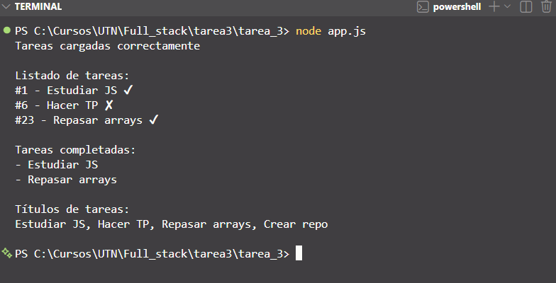

# Gestor de Tareas en JavaScript

## Descripción

Este proyecto consiste en un sistema de gestión de tareas desarrollado con JavaScript como parte de una práctica de programación orientada a objetos y asincronía. La aplicación permite crear, listar, buscar y filtrar tareas utilizando una clase GestorTareas. Además, simula la carga inicial de datos mediante promesas y utiliza async/await junto con Promise.all para manejar operaciones asíncronas en paralelo. Se utilizan métodos de arrays como forEach, map, filter, find y reduce.

## Tecnologías utilizadas

- JavaScript (ES6+)
- Node.js (opcional)

## Estructura del proyecto

```text
.
├── app.js
├── README.md
└── assets
  └── screenshots
    ├── ejecucion-1.png
```

app.js: contiene la definición de las clases, la simulación de carga de datos y el flujo principal del programa.
README.md: documentación del proyecto.
assets/screenshots: capturas de pantalla del funcionamiento del programa.

## Cómo ejecutar el proyecto

Clonar el repositorio:

git clone https://github.com/f-Ariel-Pavoni/curso-react-js-tp3-async

Ingresar al directorio del proyecto:

cd curso-react-js-tp3-async

Ejecutar el archivo principal con Node.js:

node app.js

No se requieren dependencias externas.

## Capturas de pantalla



## Ejemplo de salida

```bash
Tareas cargadas correctamente

Listado de tareas:
#1 - Estudiar JS ✔
#6 - Hacer TP ✘
#23 - Repasar arrays ✔

Tareas completadas:
- Estudiar JS
- Repasar arrays

Títulos de tareas:
Estudiar JS, Hacer TP, Repasar arrays, Crear repo
```

## Autor

**Ariel Pavoni**

